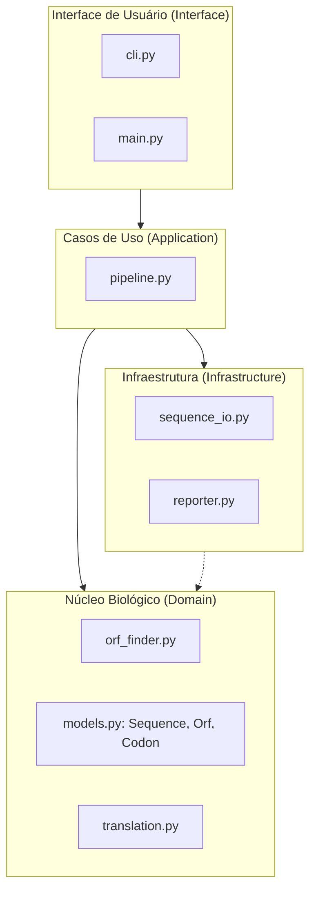
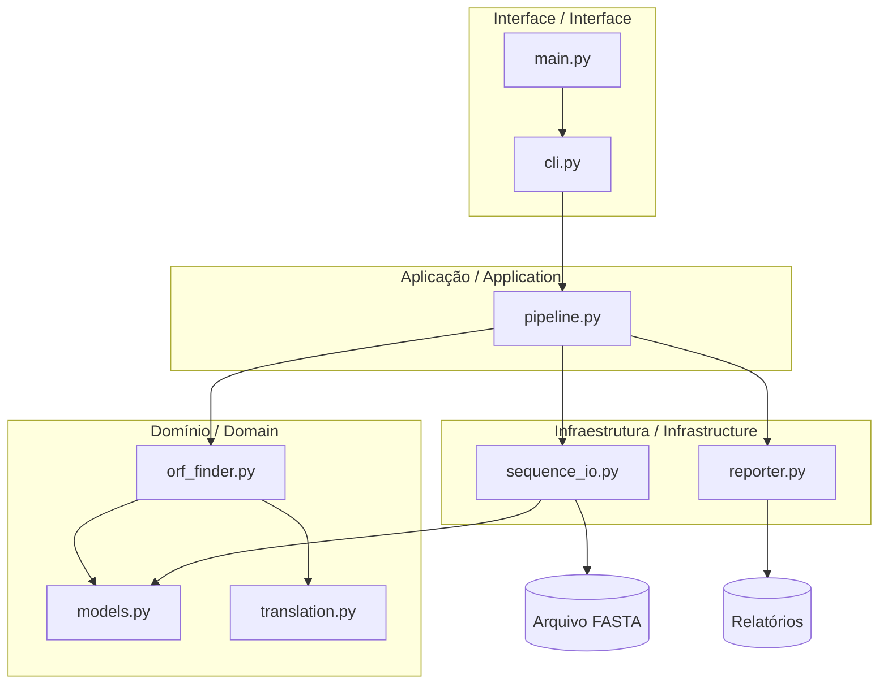
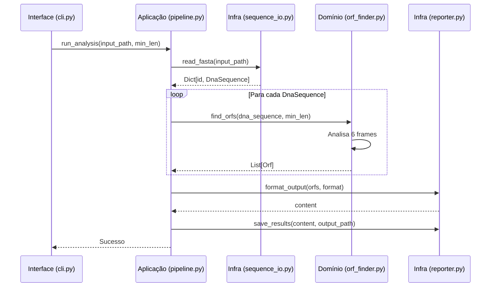
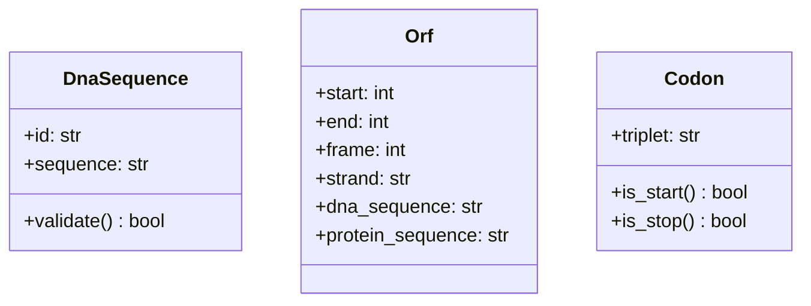

# GeneSeeker — Arquitetura do Sistema (Clean Architecture)

## 1. Visão Geral das Camadas

O GeneSeeker segue os princípios da **Clean Architecture**, garantindo que a lógica de domínio biológico seja isolada de detalhes de infraestrutura e interfaces.

## 2. Diagrama de Componentes Detalhado

## 3. Diagrama de Sequência — Pipeline de Análise

## 4. Modelagem de Domínio (Value Objects)

As entidades de domínio são implementadas como **Value Objects** imutáveis, garantindo integridade biológica desde a construção.

## 5. Leis de Dependência

1.  **Independência de Domínio**: O módulo `geneseeker.domain` não importa nada de `infrastructure`, `application` ou `interface`.
2.  **Inversão de Dependência**: A camada de aplicação orquestra os serviços de infraestrutura para alimentar o domínio.
3.  **Pureza Algorítmica**: `orf_finder.py` é uma função pura (ou conjunto de funções) que recebe dados e retorna dados, sem efeitos colaterais de I/O.
